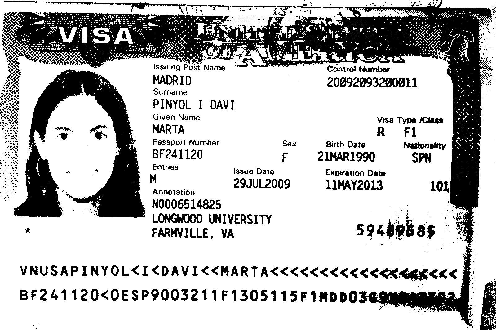
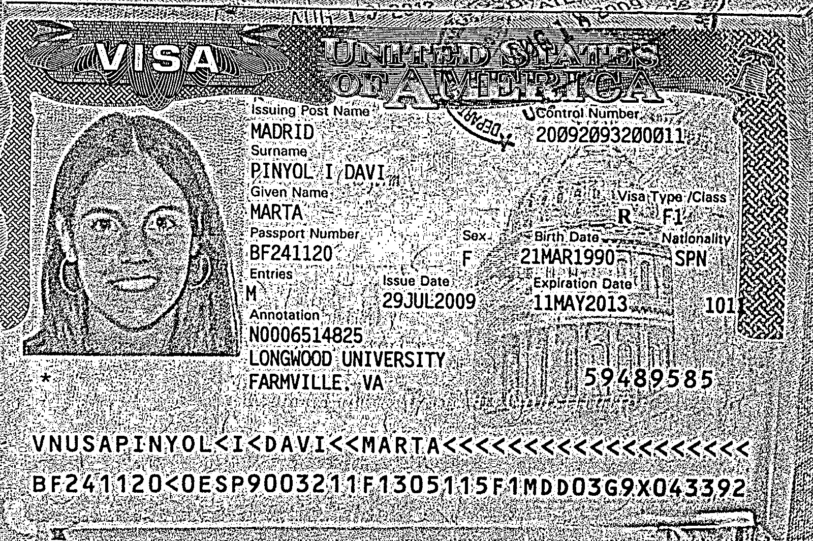

# Image adaptative thresholding for tesseract-OCR
The goal is to create a binary representation of the image, classifying each pixel into one of two categories, such as "black" or "white". This is a common task in many image processing applications, and some computer graphics applications. 

However, fixed thresholding often fails if the illumination varies spatially in the image or over time in a video stream. <br>In order to account for variations in illumination, the common solution is adaptive thresholding. The main difference here is that a different threshold value is computed for each pixel in the image.

Tesseract OCR internally applies [Otsu binarization method](https://ieeexplore.ieee.org/stamp/stamp.jsp?arnumber=4310076). However this method selects an optimal global threshold according to image histogram. If there is a shadow on the image, tesseract will fail extracting the characters.

|  Original Image  | Otsu thresholding |
| :-------------: | :----------: | 
|   |    | 
| **OpenCV Adaptative Thresholding**   |**This Repo Adaptative Thresholding** |
|    |  |

## Prerequisites
* [Python3](https://www.python.org/)
* [opencv-python](https://pypi.python.org/pypi/opencv-python)
* [numpy](https://scipy.org/install.html)

## How to use
Make sure python3 and pip is installed. Then, install cv2 and numpy.

```bash
#install opencv-python
pip install cv2
#install PyWavelets
pip install numpy
```

Let's binarize the upper post image using the script. Type on shell in project directory:

```bash
python adaptativeThreshold.py -i images/visausa.jpg
```
The script saves the black and white image as "visausa_bin.jpg" in the current directory.

## Configuring the threshold

You might need to configure the threshold depending on the image size and background color.
For example the following image:

<p align="center">
  
</p>

His optimal threshold due to high resolution is 50. Let's binarize the image using 50 as threshold. Type on bash in project directory:

```bash
python adaptativeThreshold.py -i images/hh.jpg -t 50
```
Getting the output image hh_bin.jpg on current directory.


