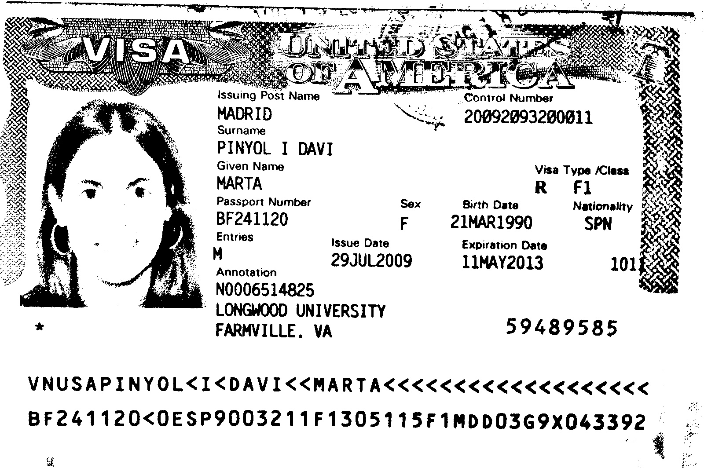

# Image adaptative thresholding for tesseract-OCR
The goal is to create a binary representation of the image, classifying each pixel into one of two categories, such as "black" or "white". This is a common task in many image processing applications, and some computer graphics applications. However, fixed thresholding often fails if the illumination varies spatially in the image or over time in a video stream.  In order to account for variations in illumination, the common solution is adaptive thresholding. The main difference here is that a different threshold value is computed for each pixel in the image. 
Tesseract OCR internally applies [Otsu binarization method](https://ieeexplore.ieee.org/stamp/stamp.jsp?arnumber=4310076). However this method selects a optimal global threshold according to image histogram. If there is a shadow on the image, tesseract will fail extracting the characters.

|  Original Image  | Otsu thresholding |
| :-------------: | :----------: | 
|   |    | 
| **OpenCV Adaptative Thresholding**   |**This Repo Adaptative Thresholding** |
|    |  |

